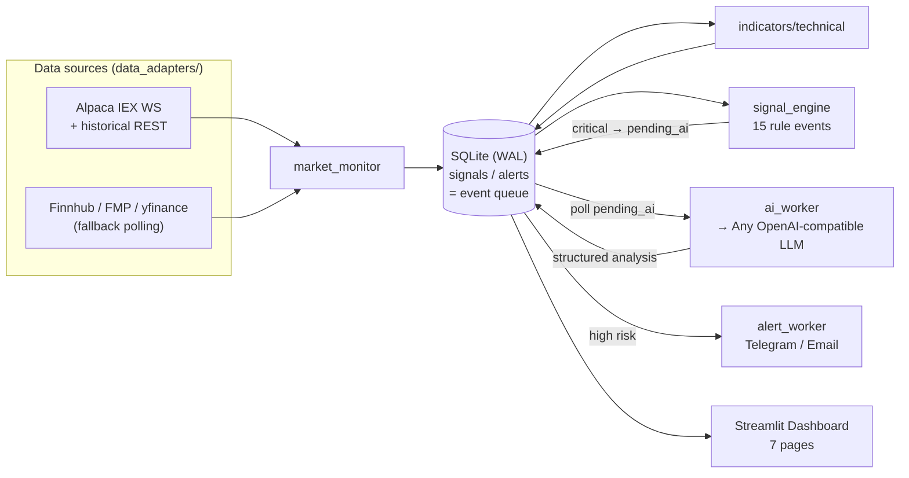

# 📡 us-stock-radar

> **Language**: English ↔ [繁體中文](README.md)

A personal **US-stock AI monitoring radar**. It watches your **holdings / high-focus / general watchlist**, computes technical indicators, detects abnormal events with a rules engine, and a resident **AI analyst** (any OpenAI-compatible LLM) proactively produces **structured research and risk reminders** — with Email / Telegram alerts on major events. The UI uses the **Taiwan color convention (🔴 up / 🟢 down)**.

> ⚠️ **Disclaimer**: This tool is for **personal monitoring and investment research only**.
> It **never places orders, never connects to any broker trading API, and never guarantees profit**. AI output is research and risk commentary, **not investment advice**. You are responsible for your own decisions.

<p align="center">
  
</p>

---

## 🖼️ Screenshots

| Portfolio (heatmap + groups + P&L) | Candlestick (drag-to-pan / scroll-zoom / range buttons) |
| :---: | :---: |
|  |  |
| **Watchlist (buy-zone highlights)** | **AI Analyst (structured research)** |
|  |  |

---

## ✨ Features

| Module | What it does |
| --- | --- |
| Real-time quotes | **Alpaca IEX WebSocket** for live trades (holdings + high-focus, capped at 30), auto-reconnect |
| History / after-hours | Alpaca historical REST as primary (cloud-reliable); a startup `backfill` seeds daily bars + indicators so you see **the prior close even when the market is closed** |
| Fallback polling | General watchlist polled via Finnhub → FMP → yfinance chain (rate-limited) |
| Indicators | MA5/10/20/60/120, RSI14, MACD, Bollinger, VWAP, volume ratio, distance-to-MA% |
| Signal Engine | 15 rule-based events (MA break/reclaim, RSI extremes, MACD cross, volume spike, % moves, near stop/target, cost breakout…) |
| AI Analyst | Resident worker reads the event queue and calls the LLM for structured JSON; tiered **cooldown** (swing 2h / long-term & high-focus 4h) to cut noise |
| Scheduling | Tiered analysis cadence (pre-open / intraday / close, US-Eastern session) |
| Holdings mgmt | **Long-term / swing** classification, **custom groups**, stop/target, bulk management |
| Watchlist | High-focus / general, **buy-zone status** (in-zone / below / above target), theme tags |
| News | Finnhub / FMP / RSS fetch + AI summary & bullish/bearish read |
| Alerts | Telegram Bot + Email SMTP (gracefully marked `skipped` if unconfigured) |
| Dashboard | Streamlit, 7 pages: Overview / Portfolio / Watchlist / Signals / AI Analyst / News / Settings |

**Core design: the rules engine compresses raw ticks into events before the LLM sees anything** — the LLM never reads per-second ticks, saving tokens and noise. Resident processes coordinate purely through SQLite (WAL mode) `signals` / `alerts` status columns as an event queue — **no Redis / Kafka needed**.

---

## 🏗️ Architecture



> Upgrading to a paid full-market SIP feed is just one new adapter (implementing the `data_adapters/base.py` interface) swapped into `market_monitor` — nothing downstream changes. See bottom.

---

## 🚀 Quickstart

> ⚠️ **Every API key is optional.** Missing keys cause **graceful degradation** (fallback or `skipped`), never a crash. The more you fill in, the more complete it gets.

### A. Local (venv)

```bash
git clone https://github.com/BDMisME/us-stock-radar.git
cd us-stock-radar

# macOS system python3 is usually too old (3.9); use 3.11+ (brew 3.12 recommended)
python3.12 -m venv .venv
source .venv/bin/activate
pip install -r requirements.txt

cp .env.example .env       # fill in your own keys (all blank still runs the demo)

python scripts/init_db.py      # create tables
python scripts/seed_demo.py    # demo: 20 holdings + 80 watchlist
python scripts/backfill.py     # seed daily bars + indicators (instant data)

streamlit run app/main.py      # → http://localhost:8501
```

For live monitoring / AI / alerts, run the resident services (one terminal each):

```bash
python services/market_monitor.py
python services/signal_engine.py
python services/ai_worker.py
python services/alert_worker.py
python services/scheduler.py
```

### B. Docker (everything in one command)

```bash
cp .env.example .env
docker compose up --build  # Dashboard → http://localhost:8501
```

### C. Zeabur (cloud)

1. Fork this repo, connect it to Zeabur.
2. Set the env vars (same as `.env`); **mount a Persistent Volume at `/data`** and set `DB_PATH=/data/us_stock_radar.sqlite`.
3. `start.sh` auto-runs init → seed → backfill → all services + dashboard.

---

## 🔑 Getting API keys (all optional)

| Service | Used for | Free tier | Sign up |
| --- | --- | --- | --- |
| **Alpaca** | Live quotes + historical bars (**start here**) | Free IEX real-time + history | <https://alpaca.markets/> |
| **Any OpenAI-compatible LLM** | AI analyst | Varies by provider — see note below | — |
| **Finnhub** | Fallback quotes / news | Free tier | <https://finnhub.io/> |
| **FMP** | Fallback quotes / fundamentals | Free tier | <https://site.financialmodelingprep.com/> |
| **Telegram Bot** | Major-event push | Free | Get a bot token from [@BotFather](https://t.me/BotFather) |

> **LLM setup**: set `LLM_API_KEY` / `LLM_BASE_URL` / `LLM_MODEL` in `.env`. Common choices:
> - **OpenAI**: `LLM_MODEL=gpt-4o`, leave `LLM_BASE_URL` blank
> - **Groq** (free tier): `LLM_BASE_URL=https://api.groq.com/openai/v1`, `LLM_MODEL=llama-3.3-70b-versatile`
> - **Volcengine ARK**: `LLM_BASE_URL=https://ark.cn-beijing.volces.com/api/v3`, `LLM_MODEL=<endpoint-id>`
> - **Gemini** (OpenAI-compat): `LLM_BASE_URL=https://generativelanguage.googleapis.com/v1beta/openai/`, `LLM_MODEL=gemini-2.0-flash`

> Just want to see the UI? **Leave everything blank** — demo data + backfill render the full dashboard.

---

## ❓ FAQ

- **No live quotes after hours / on weekends?** It backfills the **prior close** from Alpaca history, so the UI is never blank.
- **Do I need a paid data feed?** No. Free Alpaca IEX + history is enough for personal use; upgrade to SIP only if you want full-market real-time.
- **Why is red = up and green = down?** It follows the **Taiwan convention** (🔴 up / 🟢 down), opposite of the US. Charts and tables are consistent.
- **Will the AI trade for me?** **No, and it never will.** There is zero order/trading API in this project — research and risk reminders only.

---

## 🔒 Security & Privacy

- **Keys live only in `.env`** (gitignored, never committed); this repo contains no real secrets.
- Self-hosting? Use **your own** keys; the sidebar credit is customizable via the `APP_CREDIT_NAME` env var.
- ⚠️ **This is single-user by design — there is no login / auth.** If you deploy it to a public URL, anyone can view and edit your settings — **don't share your live instance URL publicly; share this repo instead.**

---

## 🧪 Tests

```bash
pytest        # indicators, signal-engine rules, DB/queue, AI JSON parsing (mocked LLM)
```

---

## 🔌 Upgrading the data source (future)

Every quote source implements the `data_adapters/base.py` interface:

```python
class QuoteAdapter:   # get_quote(symbol) / get_quotes(symbols)
class HistoryAdapter: # get_bars(symbol, timeframe, limit)
class NewsAdapter:    # get_news(symbol, limit)
```

Add one adapter, swap it into `market_monitor`, and nothing downstream (indicators / signal engine / AI / dashboard) changes:

- **Alpaca SIP** — switch `DataFeed.IEX` to `DataFeed.SIP` (subscription) for full-market real-time.
- **dxFeed Nasdaq Basic** — add `data_adapters/dxfeed_stream.py` implementing `QuoteAdapter`.
- **Finazon SIP** — add `data_adapters/finazon_client.py` implementing `QuoteAdapter` + `HistoryAdapter`.

---

## 🤝 Contributing

Issues and PRs welcome. Please run `pytest` (green) first. See [CONTRIBUTING.md](CONTRIBUTING.md).

## 📄 License

[MIT](LICENSE) © 2026 BDMisME

> Credit to reference projects (read-only, no code merged): tradingagents, stocks-analysis-ai-agents, ai-stock-dashboard, streamlit-stock-analysis.
