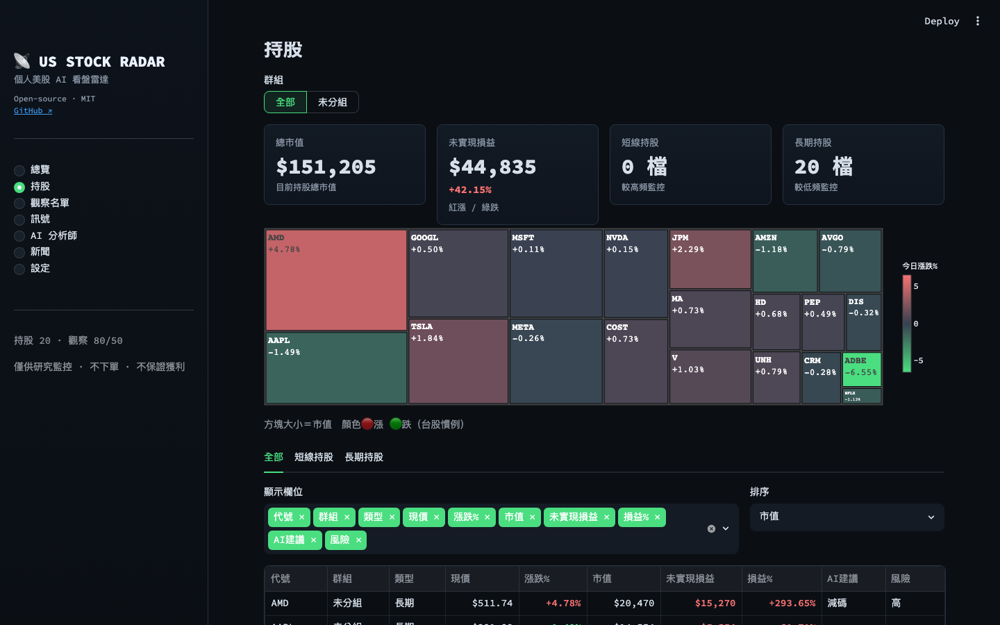
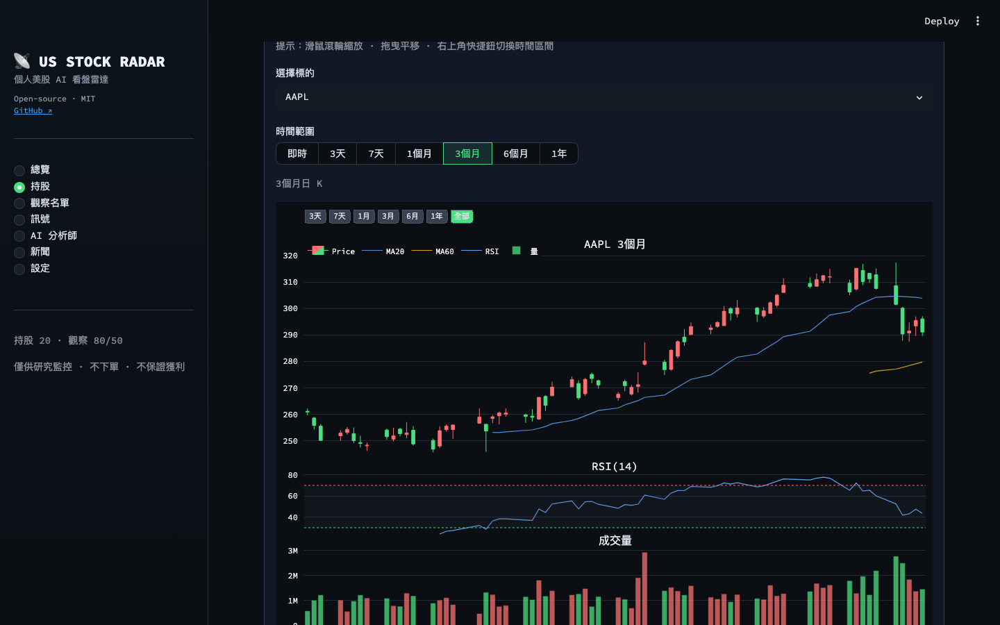
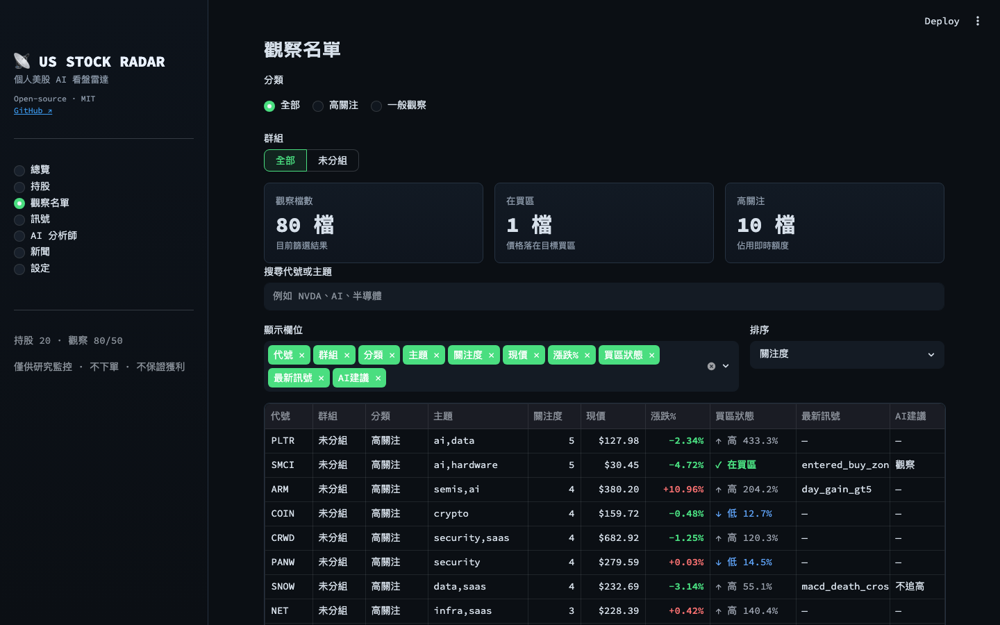
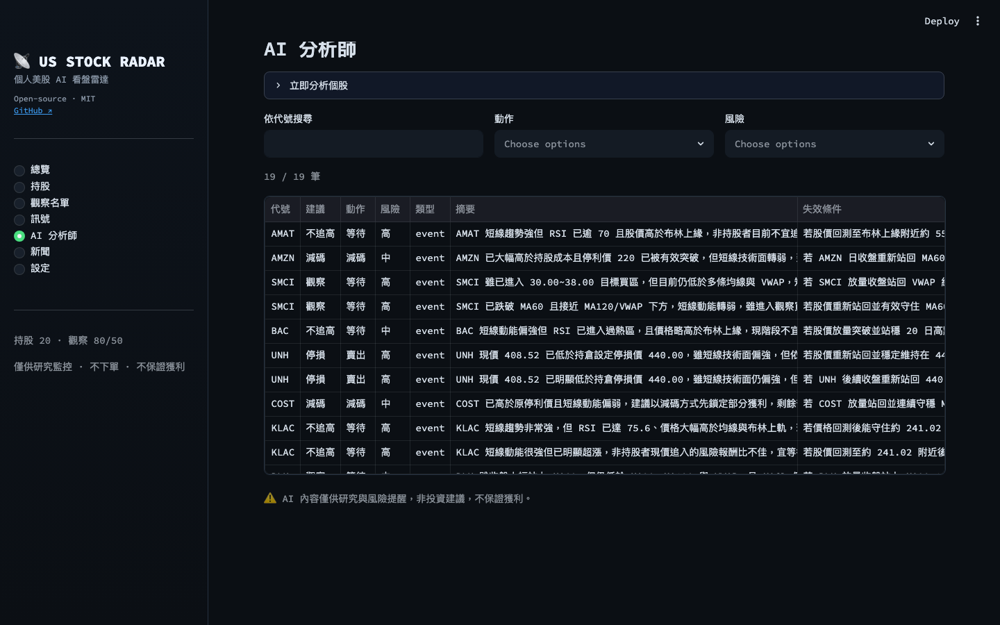
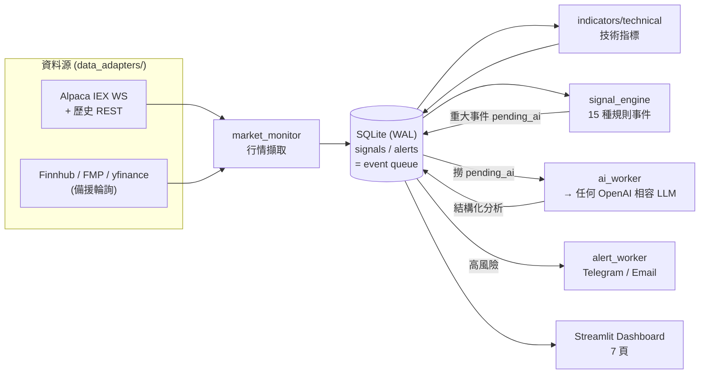

# 📡 us-stock-radar

> **語言**：繁體中文 ↔ [English](README.en.md)

個人用「美股 AI 看盤雷達」。監控**持股 / 高關注 / 一般觀察名單**，自算技術指標、用規則引擎偵測異常事件，由常駐 AI 分析師（**任何 OpenAI 相容 LLM**）主動產生**結構化研究與風險提醒**，並透過 Email / Telegram 通知重大事件。介面採**台股慣例配色（🔴 漲 / 🟢 跌）**。

> ⚠️ **重要聲明**：本工具僅供**個人監控與投資研究**。
> **不自動下單、不串接任何券商交易 API、不保證獲利**，AI 內容僅為研究與風險提醒，**非投資建議**。請自行判斷並承擔投資決策。

<p align="center">
  
</p>

---

## 🖼️ 畫面預覽

| 持股（熱力圖 + 分組 + 損益） | 個股 K 線（拖曳平移 / 滾輪縮放 / 時間快捷鈕） |
| :---: | :---: |
|  |  |
| **觀察名單（買區狀態高亮）** | **AI 分析師（結構化研究）** |
|  |  |

---

## ✨ 功能總覽

| 模組 | 說明 |
| --- | --- |
| 即時行情 | **Alpaca IEX WebSocket** 訂閱即時報價（持股＋高關注，上限 30 檔），斷線自動重連 |
| 歷史 / 盤後 | Alpaca 歷史 REST 為主（雲端可靠）；開機 `backfill` 先補日 K＋指標，**休市也看得到前一日收盤** |
| 備援輪詢 | 一般觀察名單以 Finnhub → FMP → yfinance 鏈式輪詢（含 rate limit） |
| 技術指標 | MA5/10/20/60/120、RSI14、MACD、Bollinger、VWAP、量比、距均線% |
| Signal Engine | 15 種規則事件（跌破/站上 MA、RSI 超買超賣、MACD 交叉、放量、漲跌幅、接近停損停利、突破成本…）|
| AI 分析師 | 常駐讀取事件 queue，呼叫 LLM 產生結構化 JSON；分層**冷卻**（短線 2h / 長期・高關注 4h）避免雜訊 |
| 排程分析 | 開盤前 / 盤中 / 收盤的分層分析頻率（美東時段） |
| 持股管理 | **長期 / 短線**分類、**自訂群組**、停損停利、批次管理 |
| 觀察名單 | 高關注 / 一般觀察、**買區狀態**（在買區 / 低於 / 高於目標）、主題標籤 |
| 新聞 | Finnhub / FMP / RSS 抓取 + AI 摘要與利多利空判斷 |
| 通知 | Telegram Bot + Email SMTP（未設定則自動標記 skipped，不崩潰） |
| Dashboard | Streamlit 7 頁：總覽 / 持股 / 觀察名單 / 訊號 / AI 分析師 / 新聞 / 設定 |

**設計核心：規則引擎先把 raw tick 壓縮成事件，再交給 LLM 分析** —— LLM 絕不直接讀每秒報價，省 token、降雜訊。各常駐 process 透過 SQLite（WAL 模式）的 `signals` / `alerts` 狀態欄當作 event queue 溝通，**無需 Redis / Kafka**。

---

## 🏗️ 架構



> 升級到付費全市場 SIP 資料只需新增一個 adapter（實作 `data_adapters/base.py` 介面）並在 `market_monitor` 換接，下游完全不用改。詳見文末。

---

## 🚀 Quickstart

> ⚠️ **所有 API key 皆為選填**。缺 key 時各模組會**優雅降級**（fallback 或標記 skipped），不會崩潰；填越多功能越完整。

### A. 本地（venv）

```bash
git clone https://github.com/BDMisME/us-stock-radar.git
cd us-stock-radar

# macOS 內建 python3 多半過舊（3.9），請用 3.11+（建議 brew 的 3.12）
python3.12 -m venv .venv
source .venv/bin/activate
pip install -r requirements.txt

cp .env.example .env       # 填入你自己的 key（全部留空也能跑 demo）

python scripts/init_db.py      # 建表
python scripts/seed_demo.py    # 載入 demo：20 持股 + 80 觀察名單
python scripts/backfill.py     # 補日 K + 指標（讓畫面立刻有資料）

streamlit run app/main.py      # → http://localhost:8501
```

要啟用即時監控 / AI / 通知，再各開一個終端機跑常駐服務：

```bash
python services/market_monitor.py   # 行情擷取（WebSocket + 輪詢）
python services/signal_engine.py    # 異常事件偵測
python services/ai_worker.py        # AI 分析師
python services/alert_worker.py     # 通知派送
python services/scheduler.py        # 分層排程分析
```

### B. Docker（一鍵啟動全部）

```bash
cp .env.example .env       # 填好 key
docker compose up --build  # Dashboard → http://localhost:8501
```

### C. Zeabur（雲端部署）

1. Fork 本 repo，連到 Zeabur。
2. 在 Zeabur 後台填入環境變數（同 `.env`）；**掛載 Persistent Volume 到 `/data`** 並設 `DB_PATH=/data/us_stock_radar.sqlite`。
3. `start.sh` 會自動建表、seed、backfill、啟動所有服務與 Dashboard。

---

## 🔑 如何取得 API Key（全部選填）

| 服務 | 用途 | 免費額度 | 申請連結 |
| --- | --- | --- | --- |
| **Alpaca** | 即時報價 + 歷史 K（**最推薦先辦這個**） | 免費 IEX 即時 + 歷史資料 | <https://alpaca.markets/> |
| **任意 OpenAI 相容 LLM** | AI 分析師 | 各家不同，見下方說明 | — |
| **Finnhub** | 備援報價 / 新聞 | 免費 tier | <https://finnhub.io/> |
| **FMP** | 備援報價 / 基本面 | 免費 tier | <https://site.financialmodelingprep.com/> |
| **Telegram Bot** | 重大事件推播 | 免費 | 跟 [@BotFather](https://t.me/BotFather) 申請 bot token |

> **LLM 設定方式**：在 `.env` 填入 `LLM_API_KEY` / `LLM_BASE_URL` / `LLM_MODEL`。常見選擇：
> - **OpenAI**：`LLM_MODEL=gpt-4o`，`LLM_BASE_URL` 留空
> - **Groq**（免費額度）：`LLM_BASE_URL=https://api.groq.com/openai/v1`，`LLM_MODEL=llama-3.3-70b-versatile`
> - **火山方舟 ARK**：`LLM_BASE_URL=https://ark.cn-beijing.volces.com/api/v3`，`LLM_MODEL=<endpoint-id>`
> - **Gemini**：`LLM_BASE_URL=https://generativelanguage.googleapis.com/v1beta/openai/`，`LLM_MODEL=gemini-2.0-flash`

> 只想先看畫面？**全部留空**直接跑，demo 資料 + backfill 就能看到完整 UI。

---

## ❓ FAQ

- **盤後 / 假日沒有即時報價怎麼辦？** 系統會用 Alpaca 歷史資料補上**前一日收盤**，畫面不會空白。
- **一定要付費資料源嗎？** 不用。免費 Alpaca IEX + 歷史就足夠個人使用；要全市場即時再升級 SIP。
- **為什麼紅色是漲、綠色是跌？** 採**台股慣例**（🔴 漲 / 🟢 跌），與美股相反。圖表與表格一致。
- **AI 會幫我下單嗎？** **不會，也永遠不會。** 本專案無任何下單 / 交易 API，僅做研究與風險提醒。

---

## 🔒 安全與隱私

- **金鑰只放 `.env`**（已被 `.gitignore` 排除，永不進 git）；本 repo 不含任何真實金鑰。
- 自架請填入**你自己的** key；側欄署名可用 `APP_CREDIT_NAME` 環境變數自訂。
- ⚠️ **本工具為單用戶設計，沒有登入 / 權限機制**。若你把實例部署到公開網址，任何人都能看到並修改你的設定 —— **請勿公開分享你的線上實例網址，要分享請分享本 repo**。

---

## 🧪 測試

```bash
pytest        # 涵蓋技術指標、Signal Engine 規則、DB/queue、AI JSON 解析（mock LLM）
```

---

## 🔌 升級資料源（未來）

所有行情來源都實作 `data_adapters/base.py` 介面：

```python
class QuoteAdapter:   # get_quote(symbol) / get_quotes(symbols)
class HistoryAdapter: # get_bars(symbol, timeframe, limit)
class NewsAdapter:    # get_news(symbol, limit)
```

新增一個 adapter 並在 `market_monitor` 換接即可，下游（指標 / Signal Engine / AI / Dashboard）完全不需改：

- **Alpaca SIP** — 把 `DataFeed.IEX` 換成 `DataFeed.SIP`（需訂閱），即得全市場即時。
- **dxFeed Nasdaq Basic** — 新增 `data_adapters/dxfeed_stream.py` 實作 `QuoteAdapter`。
- **Finazon SIP** — 新增 `data_adapters/finazon_client.py` 實作 `QuoteAdapter` + `HistoryAdapter`。

---

## 🤝 貢獻

歡迎 issue / PR。請先跑 `pytest` 確認綠燈。詳見 [CONTRIBUTING.md](CONTRIBUTING.md)。

## 📄 授權

[MIT](LICENSE) © 2026 BDMisME

> 致謝參考專案（僅閱讀、未合併程式碼）：tradingagents、stocks-analysis-ai-agents、ai-stock-dashboard、streamlit-stock-analysis。
